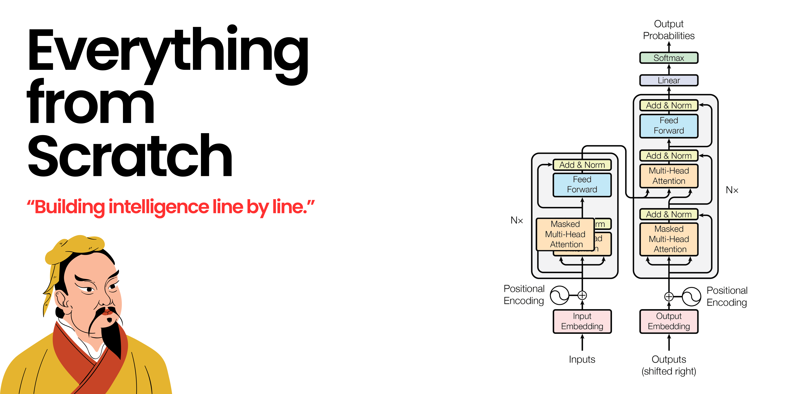

---
hide:
  - toc
  - navigation
---
# 
<!-- # **Building everything from Scratch** -->

## **Language Models**

- [:simple-openai: __GPT-2__](https://github.com/gauravreddy08/everything-from-scratch/tree/main/GPT2){:target="_blank"}
- [:simple-meta: __Llama 2__](https://github.com/gauravreddy08/everything-from-scratch/tree/main/llama2){:target="_blank"}
- [:simple-meta: __Llama 3__](https://github.com/gauravreddy08/everything-from-scratch/tree/main/llama3){:target="_blank"}
- [:simple-meta: __Llama 3.1__](https://github.com/gauravreddy08/everything-from-scratch/tree/main/llama3.1){:target="_blank"}
- [:material-fuel-cell: __LSTM__](https://github.com/gauravreddy08/everything-from-scratch/tree/main/LSTM){:target="_blank"}

## **Machine Learning Models**

- [:material-chart-timeline-variant-shimmer: __Linear Regression__](https://github.com/gauravreddy08/everything-from-scratch/blob/main/ml-models/LinearRegression.py){:target="_blank"}
- [:material-chart-bell-curve-cumulative: __Logistic Regression__](https://github.com/gauravreddy08/everything-from-scratch/blob/main/ml-models/LogisticRegression.py){:target="_blank"}
- [:material-chart-bell-curve-cumulative: __Multinomial Logistic Regression__](https://github.com/gauravreddy08/everything-from-scratch/blob/main/ml-models/MultinomialLogisticRegression.py){:target="_blank"}
- [:material-scatter-plot: __K-Nearest Neighbors (KNN)__](https://github.com/gauravreddy08/everything-from-scratch/blob/main/ml-models/KNN.ipynb){:target="_blank"}
- [:material-chart-scatter-plot-hexbin: __K-Means Clustering__](https://github.com/gauravreddy08/everything-from-scratch/blob/main/ml-models/KMeans.ipynb){:target="_blank"}
- [:material-graph-outline: __MLP (Neural Network from Scratch)__](https://github.com/gauravreddy08/everything-from-scratch/blob/main/ml-models/MLP.py){:target="_blank"}

## **Attention Mechanisms**

- [:material-format-letter-matches: __Self Attention__](https://github.com/gauravreddy08/everything-from-scratch/blob/main/Attention/SelfAttention.py){:target="_blank"}
- [:material-multicast:  __Naive Multi-Head Attention__](https://github.com/gauravreddy08/everything-from-scratch/blob/main/Attention/NaiveMultiHeadAttention.py){:target="_blank"}
- [:material-multicast: __Multi-Head Attention__](https://github.com/gauravreddy08/everything-from-scratch/blob/main/Attention/MultiHeadAttention.py){:target="_blank"}
- [:material-upload-multiple: __Multi-Query Attention__](https://github.com/gauravreddy08/everything-from-scratch/blob/main/Attention/MultiQueryAttention.py){:target="_blank"}
- [:fontawesome-solid-arrows-up-to-line: __Grouped-Query Attention__](https://github.com/gauravreddy08/everything-from-scratch/blob/main/Attention/GroupedQueryAttention.py){:target="_blank"}

!!! note ""
    More implementations coming soon!

