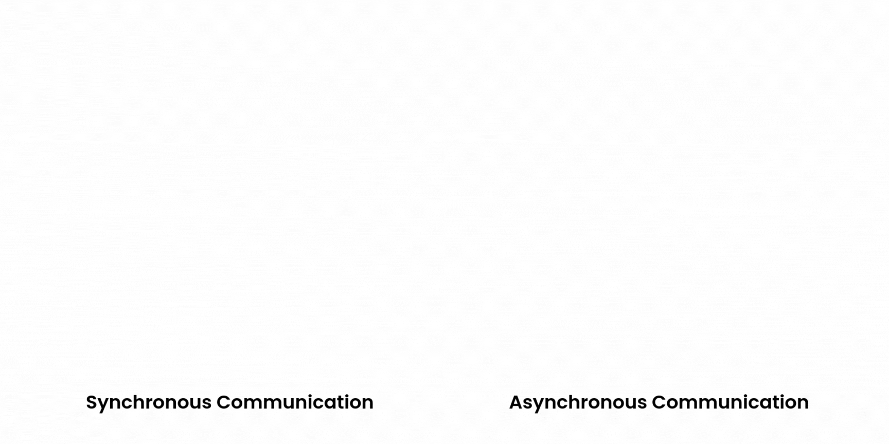
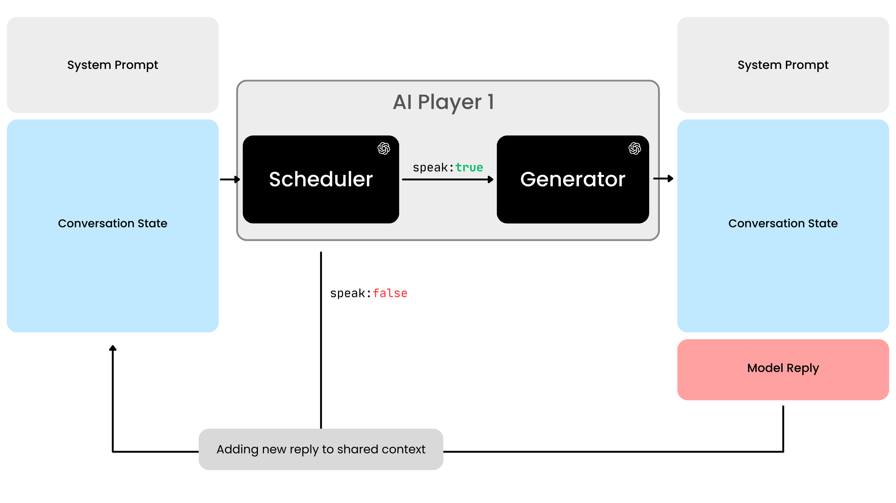
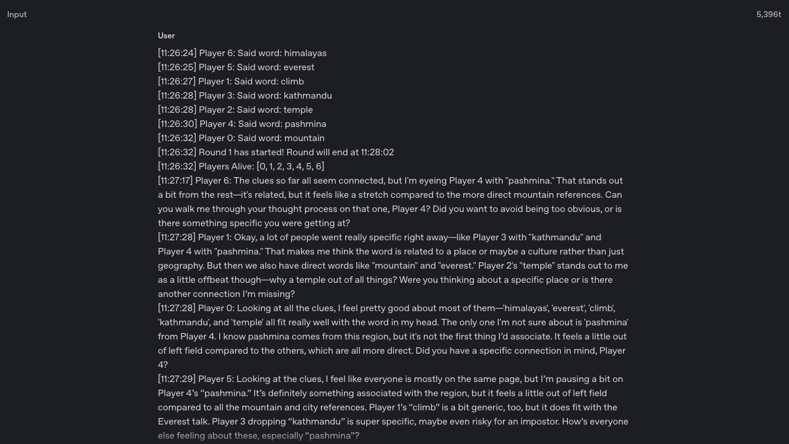

# **Part I. Reinventing AI Conversations**

??? tip "YouTube Video"

    

    <iframe width="560" height="315" src="https://www.youtube.com/embed/vYAvMhPeBVc?si=4IP5tqFfKdGkiECx" title="YouTube video player" frameborder="0" allow="accelerometer; autoplay; clipboard-write; encrypted-media; gyroscope; picture-in-picture; web-share" referrerpolicy="strict-origin-when-cross-origin" allowfullscreen></iframe>
    

Today, AI feels more robotic than human. Don't get me wrong, they're brilliant when prompted, but they lack that natural human instinct of knowing when to chime in.

!!! note ""

    **Problem**: The AI we know today, only understand _"what to talk"_, but not _"when to talk"_. They don't message you when they want to, they only respond when you ask them to. It's completely event-driven. 

## **A Game of Deception**

Mafia is a social deduction game where players try to identify hidden killers among them. The killers work to blend in, deflecting suspicion and manipulating conversations. It's the perfect showcase for natural communication timing.

In this game, one has to intuitively know not just **what to say**, but **when to say** it. Sometimes silence is strategic. Other times, jumping into a heated debate shifts everything. 

## **The Two-Part Brain**

Inspired by the ["Time to Talk" paper](https://arxiv.org/abs/2506.05309), I split each AI agent into two parts:

!!! note ""
    **Scheduler:** Decides "when to speak" by analyzing conversation flow and finding optimal moments to speak.

!!! note ""
    **Generator:** Handles "what to say", crafting responses, forming arguments, generating content.

These modules will work together, creating AI agents that finally decide for **themselves** when to join conversations.

## **Shared Conversational Space**

!!! quote ""
    ###### When building with AI, my philosophy is to **always think like a human**.

<caption>Context input of six AI agents playing Undercover (a version of Mafia)</caption>

What's most common and chaotic multi human communication? **Group chats.**

To be honest, in group chats, we rarely take turns to talk. We jump in when we have something valuable to add, when someone mentioned us, or when the discussion needed our perspective. The flow is organic, sometimes chaotic, but always natural.

I implemented this with AI, I gave all AI agents access to the same conversational context—like everyone in a group chat seeing the same messages. 

> The crucial addition was protecting this shared context from race conditions.

The scheduler analyzes ongoing conversation and decides whether to activate the generator. This created genuinely human-like interactions.

## **Agents learn to Interrupt**

AI agents, were able to replicate:

- **Strategic silence:** Agents knew when to stay quiet
- **Perfect timing:** Agents chose optimal moments to interject with key points
- **Adaptive verbosity:** Some imposter agents became overly talkative to deflect suspicion

**Result:** Conversations became more natural and chaotic. Agents started speaking over each other, interrupting, responding to the actual flow of discussion. 

The entire system transformed from rigid, turn-based interaction into something that felt alive and unpredictable, just like real human conversation

??? quote "AI is typing..."

    I also added a feature showing which agents were currently "typing", like those three dots we see in messaging apps. This became another strategic element, as agents would observe who was about to speak and adjust their timing accordingly.

## **AI becomes human?**

The fascinating behavioral patterns I discovered, particularly how AI agents handle deception and detection, are explored in my next post: [Part II: **"When AI Masters the Art of Deception"**](../Part-II/index.md).

!!! quote "Open to work"

    [:material-file-document: Resume](../../../resume.pdf){:target="_blank"}

