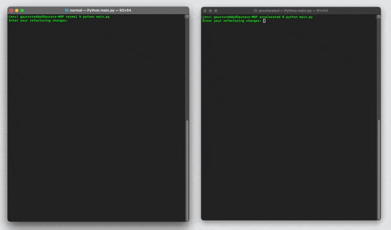
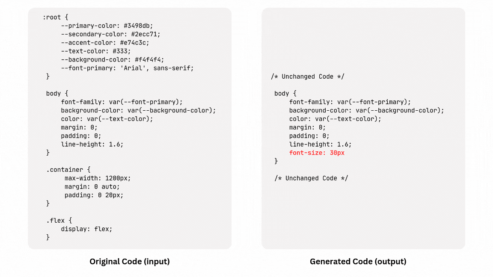

# **Making LLM code-generation go burrr...**

<a href='https://youtube.com/watch?v=9T9ORFVy3v8'><strong>Watch Demo on Youtube</strong></a>

??? quote "TL;DR"

    

    
    

    
### __Why do we need to speed up?__

Because Waiting is the Worst. We all love fast things, faster cars, faster internet, faster food delivery!

But in all seriousness, Code LLMs are meant to supercharge developers, making them faster, more efficient, and more productive. But what happens when the very tool meant to help starts slowing things down? Imagine you need a small tweak in your file, but every time you make a change, you have to wait an entire minute for the model to regenerate the whole thing. That’s a productivity nightmare.

If I were in that position, I’d rather have three quick attempts—each taking ten seconds—with two failing but one succeeding, rather than waiting a full minute for a single, theoretically “perfect” response. Speed matters, and that’s exactly why optimizing the generation process is crucial.

### **The Naïve Approach: Full-File Rewrite**

The simplest, most obvious way to apply an LLM to code generation is to have it rewrite the entire file. But let’s be real—when only one line in a 500-line file has changed, asking the model to regenerate everything is like cooking an entire Thanksgiving dinner just because you want to add a pinch of salt to the mashed potatoes. Wasteful, expensive, and completely unnecessary.

Now, you might say, “Why not just tell the LLM to modify that single line?” Sure, but if the user is capable of pinpointing the exact change, then why use automation in the first place? The whole point of using an LLM is to let it handle the tedious parts, not to make the user play detective.

### **The *Optimized* Approach: Speculative Decoding**

> *[Speculative decoding](https://arxiv.org/abs/2211.17192)*—a technique that brings efficiency without sacrificing accuracy.

At its core, speculative decoding uses two models:
- A *draft model* (smaller, faster) that predicts the parts of the code that remain unchanged.
- A *target model* (larger, more powerful) that focuses only on generating the parts that actually need computation.

Instead of making the target model do all the heavy lifting, we let the draft model handle the low-effort stuff. The result? A speed boost with minimal loss in quality.

Now, an even slicker variation of this method, particularly useful for refactoring, is treating the existing code as if it were the draft model’s output. Since most of the code remains unchanged, we assume those tokens are already “predicted” and let the target model focus on the truly modified sections.

### **Final Approach: *Smarter, Not Harder***

What if we ask LLMs to only generate the parts that need to be changed instead of rewriting everything? This approach is faster, more cost-efficient (fewer tokens are generated), and much easier on the eyes than sifting through 1000 lines of regenerated code.

##### How do we do this?

Simple. We ask the LLM to omit unchanged code using markers like `# unchanged code here`, ensuring that only the necessary modifications are generated.

Then comes the challenge: how do we integrate these changes into the existing code? This is where [tree parsers](https://tree-sitter.github.io/tree-sitter/) come in. Using them, I can analyze the generated code, identify changed code blocks, and update only those specific sections in the original file. If there’s a new code block, it gets added. If an existing block has changed, only that portion gets rewritten.

For example, I took a 450-line CSS file and asked the LLM to change just one line—setting the `font-size` in the `body` selector to `50px`. Instead of regenerating the entire file, the LLM only produced the `body` selector class and denoted the remaining code as unchanged. Using precomputed code blocks and simple hash lookups, I identified that only the `body` selector had been modified, ensuring that only that portion was updated.

To explain it more clearly, let’s say my CSS file contains 30 different selectors, among which only one—`body`—needs a change. If we denote the input selectors as A, B, C, D, etc., and the output selectors as `...` (for comments), B' (for changed selectors), and E (for new selectors), we compare these and apply only the necessary updates. This comparison process, powered by hash lookups, ensures precise, efficient modifications.

## **Final Comparision**

<iframe width="560" height="315" src="https://www.youtube.com/embed/9T9ORFVy3v8?si=Y-xETDWVhQ7jvC_w" title="YouTube video player" frameborder="0" allow="accelerometer; autoplay; clipboard-write; encrypted-media; gyroscope; picture-in-picture; web-share" referrerpolicy="strict-origin-when-cross-origin" allowfullscreen></iframe>

<!--  -->

### **The Numbers (stats)**

While the input tokens remain the same, the naive approach generates **2174 output tokens**, whereas the smarter approach generates **61**. Likewise, the time taken in the naive approach is **66 seconds**, while the optimized method takes less than **4 seconds (20x boost)**. 

> I used OpenAI’s GPT-4o API for these results, but we could achieve even better performance using an on-device model.

!!! abstract "Implemented code to reproduce"
    Do follow me! [__Github__ :simple-github:](https://github.com/gauravreddy08/codegen-accelerated){:target="_blank"}

??? quote "Credits"
    Credits go to [Continue Blog](https://blog.continue.dev/instant-apply/){:target="_blank"}—just learning, implementing, and hoping to bring fresh eyes to the space! 🚀

!!! quote "Open to work"

    [:material-file-document: Resume](../../resume.pdf){:target="_blank"}

