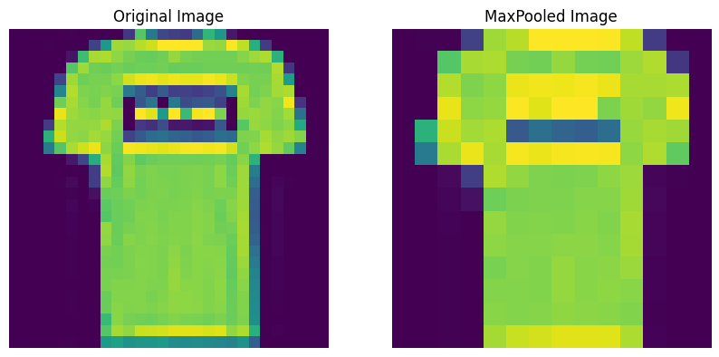
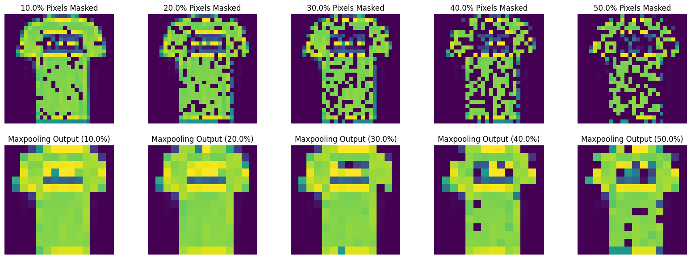
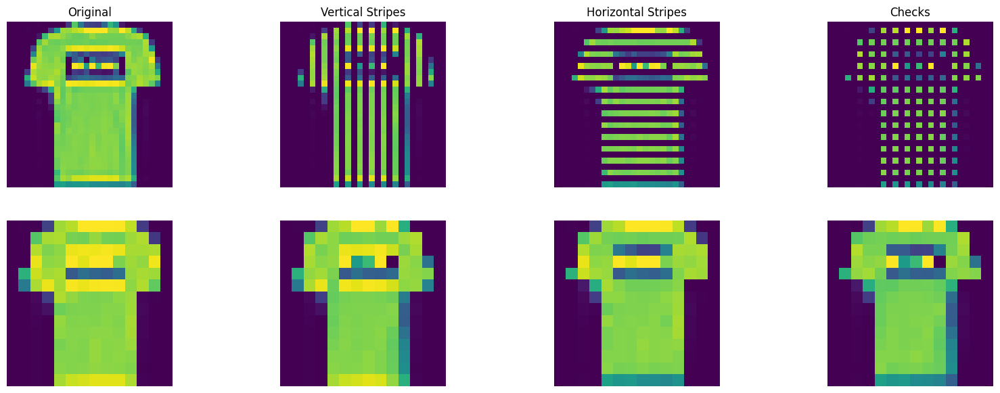
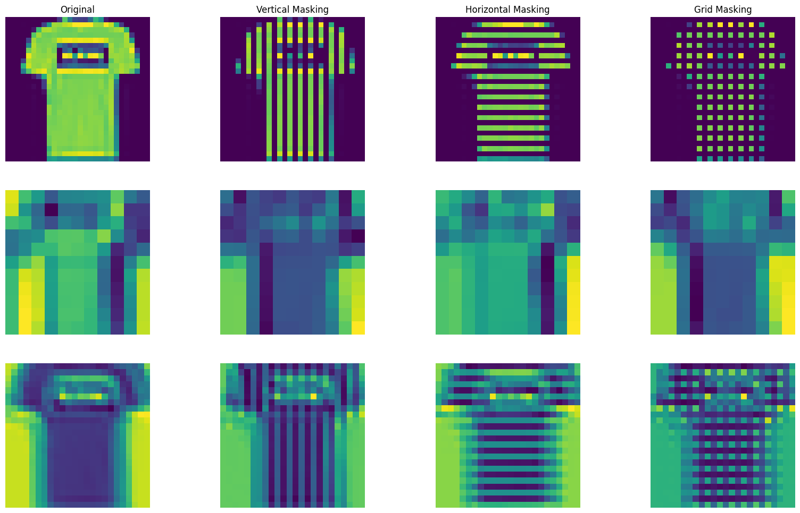
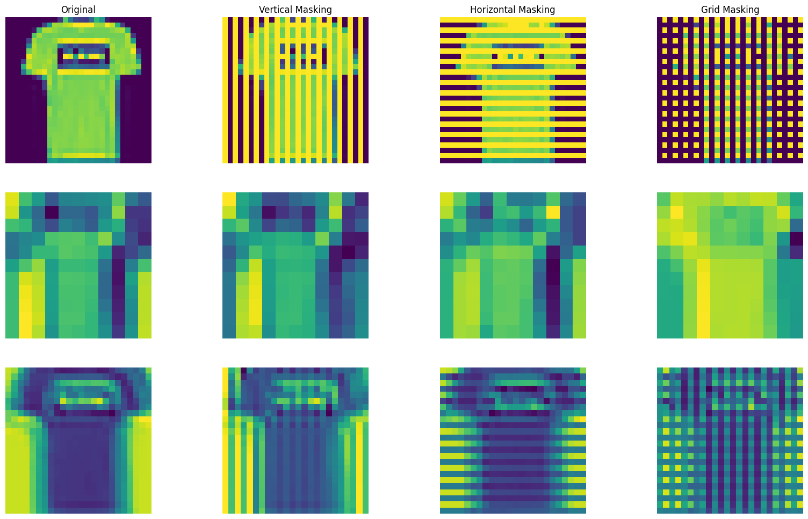

# **Rethinking Pooling Layers**

When you first learn about convolutional neural networks (CNNs), pooling layers are often perceived as nothing more than supporting layers that reduce the dimensionality of data. The focus, typically centers on convolutional layers, regarded as the "workhorses" (main components) behind the models. Pooling layers, in comparison, appear to serve a simpler, more mechanical role—merely condensing input data by downsampling. But this view underestimates their true contribution.

Pooling layers do far more than just reduce dimensionality. Their real power lies in the subtle yet crucial property they introduce into the network—**approximate invariance**. In fact, the invariance provided by pooling layers might be even more crucial to a CNN’s success than many realize, making them essential to the network's overall performance.

!!! question "What is Invariance?"

    **Invariance** refers to a system’s ability to remain stable and unaltered despite transformations or variations in its input.

## Why do we even need Invariance? 

Invariance is critical in real-world applications, especially in image recognition, where the same object can appear in a variety of forms. Consider a series of photos of a cat: in one image, the cat might be curled up under a table; in another, it's illuminated by different lighting; in yet another, the cat is slightly turned. To the human brain (a gigantic neural network), these are trivial changes, and the cat is instantly recognizable in all cases.

However, in a artificial neural network, without invariance mechanisms, every minor shift—be it a pixel-level variation or a slight translation—could throw off the model’s recognition ability. This is where the pooling layer steps in, ensuring that the model focuses on the key features of the input, regardless of small transformations or perturbations.

## How do pooling layers introduce "_Approximate Invariance_"

Pooling layers consolidate information (features), condensing regions of the image and distilling the most important aspects. Pooling, especially **max pooling**, does this by selecting the dominant value in a small patch of the input, the pixel with the highest intensity. This dominant value usually corresponds to the most critical feature within that region.

<figure markdown="span">
  
  <figcaption>
    (Left) Unprocessed input, showing full pixel-level detail. 
     
    (Right) After max pooling, the image is simplified, retaining only the dominant features (like the shirt’s outline).</figcaption>
</figure>

The strength of this approach lies in its **ability to withstand small variations**. The dominant feature within a patch tends to remain stable, even when slight distortions, shifts, or noise affect the image. In practice, this means that when a small part of an image is shifted or altered, the dominant feature in that region is likely to stay the same, keeping the network’s response consistent. This allows the model to generalize more effectively by disregarding minor changes that don’t impact the overall structure of the image.

As a result, pooling layers provide the network with **approximate translational invariance**. By making CNNs less sensitive to small, local variations, pooling layers smooth out irrelevant details and allow the model to concentrate on the larger, more significant patterns. In this way, pooling layers add a layer of stability to the unpredictable nature of real-world inputs, helping the network avoid overreacting to every minor change.

Let us see how this operates in practice...

To explore how well max pooling layers handle real-world imperfections, I simulated minor aberrations and noise in images by masking portions of them. This allowed me to test how resilient max pooling is when faced with such distortions.

### Random Masking

In the first test, I introduced random masking to the image by setting various portions of the pixels to zero (in proportions of 0.1, 0.2, 0.3, 0.4, and 0.5). Despite this random masking, the max pooling layer successfully overlooked these aberrations and was able to filter out the noise, maintaining the primary structure of the object in the image—a T-shirt from the Fashion MNIST dataset. The pooling layer’s ability to focus on the dominant features ensured that the core shape of the object remained intact, even when sections of the image were obscured.

### Patterned Masking

In the second test, I applied a more structured form of masking by creating vertical and horizontal lines of occlusion across the image. Remarkably, even with this patterned masking, the max pooling layer continued to filter out these distortions and preserve the shape of the T-shirt. I also introduced a more complex grid-like pattern by combining both vertical and horizontal masking. Surprisingly, the max pooling layer still performed effectively, ignoring the structured noise and focusing on the main features of the T-shirt.

### Adding Convolution into the picture

To deepen the analysis, I extended the experiment by building two simple CNN models: one with a max pooling layer between two convolutional layers, and another without any pooling.

The CNN model without max pooling exhibited a tendency to not only map out the intended features of the input but also to capture and propagate the unwanted noise and aberrations that we want the network to ignore. In contrast, the CNN model with max pooling was able to filter out these irrelevant patterns, focusing more on the core structure of the object (a T-shirt, in this case). This demonstrates how max pooling provides an essential safeguard against the network overfitting to small, irrelevant variations in the data.

One potential critique of these experiments is the interaction between masking (setting pixel values to zero) and the function of max pooling, which selects the maximum-valued pixel in each region. To address this, I conducted a follow-up test using inverse masking, where I maxed out pixel values instead of setting them to zero. This approach introduces aberrations in a way that could potentially confuse the network differently.

Once again, the CNN model without max pooling captured these high-valued aberrations and passed them through the layers, learning from the noise that should ideally be ignored. The model with max pooling, however, remained largely unaffected by these noisy regions and continued to focus on the main features of the image.

!!! info "Approximate, Not Absolute"

    However, it’s important to note that pooling layers don’t provide **perfect** invariance. Their capacity to smooth over local variations is only approximate. The network is still dependent on the structure of the input, and if the transformation becomes too large—such as a significant rotation or a drastic shift—the pooling layer alone won’t be able to maintain stability in the output.

In conclusion, while convolutional layers are typically viewed as the "workhorses" of CNNs, it is the pooling layers that introduce an essential property, allowing these networks to function more reliably in real-world environments. By embedding **approximate invariance**, pooling layers ensure that CNNs stay focused on the most critical features and aren't derailed by trivial variations. Far from being passive tools for dimension reduction, pooling layers play a crucial role in shaping the network's ability to generalize and maintain stability, making them indispensable to the overall success of CNNs.