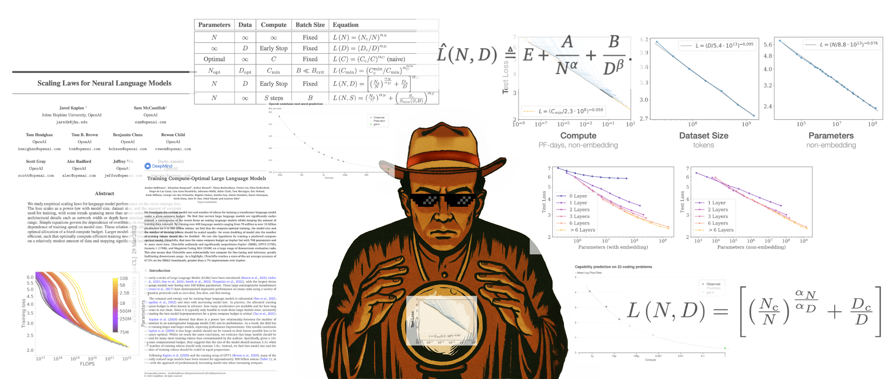
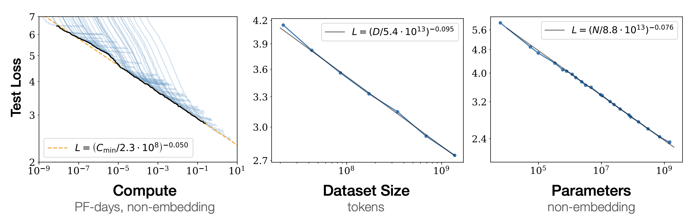
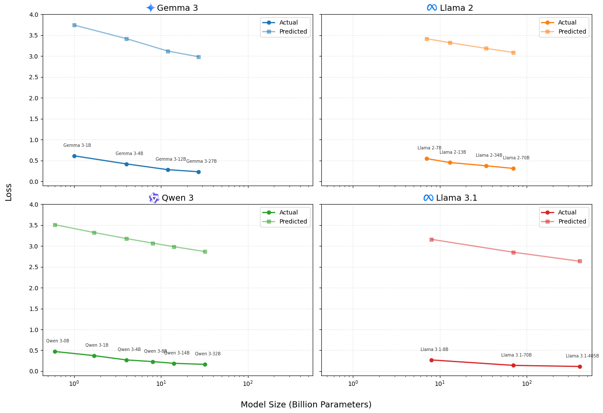
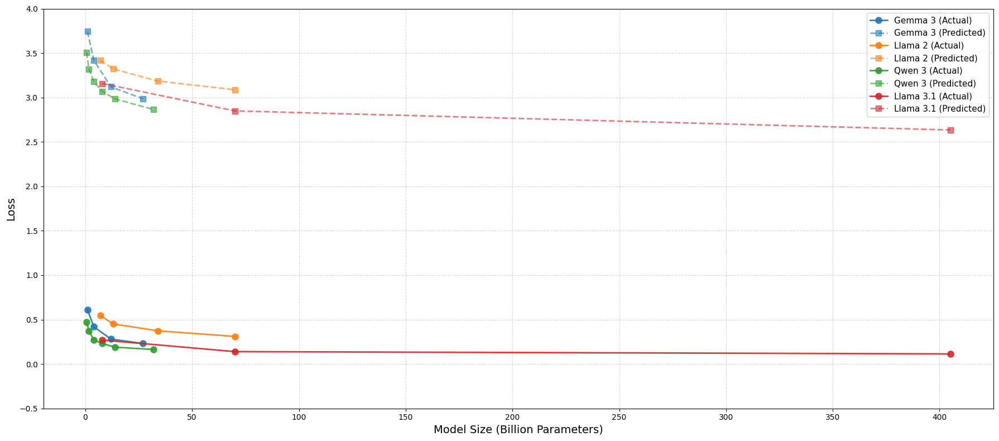
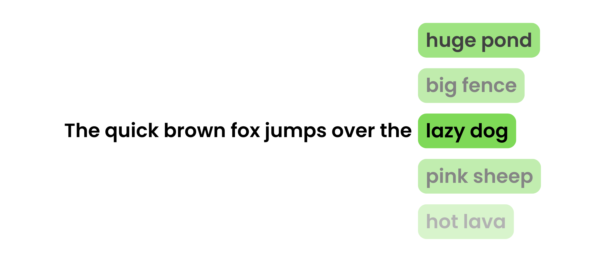
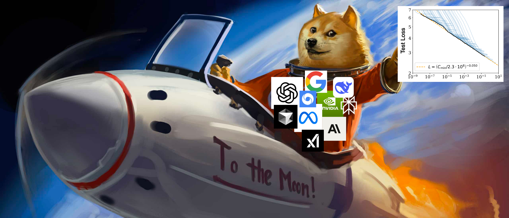

{width=92%}

# **Why Betting Against Scaling is a Losing Game**

We've all thought about that moment **"if only I had gone back a decade, I'd have invested in Bitcoin"**. Well, the only way it is possible
if your past self had some kind of mathematical formula to predict future price. In AI, something similar has already happened.

In 2020, OpenAI released, **_"Scaling Laws for Neural Language Models"_**. The paper showed that AI model performance follows predictable mathematical curves when you scale three things together: model size, training data, and compute power. The relationship is surprisingly precise, you can literally calculate how much better a model will perform if you make it 10x larger.

**This changed everything.** Before scaling laws, AI research felt like throwing darts in the dark. Teams would try different architectures, training tricks, and novel approaches, never knowing if they'd work. Scaling laws didn't eliminate the need for smart engineering, you still need efficient training algorithms, better hardware utilization, and architectural improvements. But it gave everyone a clear formula: bigger models + more data + more compute = predictably better performance.

$$
L(N,D) = [(Nc/N)^(αN/αD) + (Dc/D)]^αD
$$

<!-- {width=100%} -->

## **Market's Trillion-Dollar Bet on Mathematical Certainty**

NVIDIA hit $44.1 billion in Q1 2025 revenue, up 69% year-over-year. Meanwhile, Mira Murati, former OpenAI CTO, reportedly raised $2 billion at a $10 billion valuation for her [startup](https://thinkingmachines.ai/), while shipping nothing more than an HTML landing page. Mark Zuckerberg bought 49% of [Scale AI](https://www.scale.com/), betting on data's value for scaling models. These aren't random bets. Investors can now point to scaling law graphs and predict returns with unusual confidence.

The scaling laws did something rare in tech: they made innovation predictable. For the first time, you could say "invest X in compute and Y in data, get Z performance" and actually mean it. **AI shifted from research gamble to execution race.**

## **Do these laws still hold true today?**

**To answer this, I did a little bro math.**

Since modern labs rarely publish training loss directly, I used MMLU (Massive Multitask Language Understanding) scores as a proxy for model performance. To approximate inverse model loss, I used a simplified transformation:

$$
\text{Proxy loss} = 1 - \frac{\text{MMLU}}{100}
$$

While this isn't theoretically perfect, MMLU captures task accuracy while training loss measures token-level prediction entropy. It gives us a directionally valid curve that often tracks generalization capacity. I plotted four major model families against their predicted scaling trajectories and compared them against the power-law trendlines.

{width=100%}
/// caption
Solid line represent the proxy loss (1 - MMLU / 100) with their respective scaling law trendlines.
///

> Don't focus on the exact values, scaling laws had tight constraints around the specific models, WebText data, and fixed hyperparameters they used in 2020. Plus these current models have tons of architectural improvements compared to 2020. But focus on the trends.

You can see how current models scale up and improve follows almost identical slope to what the scaling laws predicted. 

> On a side note, surprisingly my "bro math" seems to hold up with a constant offset between test loss and my MMLU proxy.

You might argue two parallel lines aren't convincing enough. But look at figure below, all model families together with their respective Kaplan scaling law trendlines. **They actually fall right into the pattern!**

{width=100%}
/// caption
All model families together with their respective Kaplan scaling law trendlines.
///

Little did you know, OpenAI already did the same analysis with GPT-4. (1)
{ .annotate }

1. _"To verify the scalability of our optimization infrastructure, we predicted GPT-4’s final loss on our internal codebase by fitting a scaling law, from models trained using the same methodology but using at most 10,000x less compute than GPT-4. This prediction was made shortly after the run started, without use of any partial results. The fitted scaling law predicted GPT-4’s final loss with high accuracy."_ - [GPT-4 Technical Report](https://cdn.openai.com/papers/gpt-4.pdf)

## **How low can we go?**

Classic human greed. Once we know we're making progress, we immediately want to know how far we can push it. I get it.

Can we reach zero loss? Not in language modeling. Language is inherently multimodal and ambiguous. Even humans don’t produce deterministic completions. Theoretical work — including the Chinchilla paper — estimates an entropy floor of ~1.69 nats/token for English corpora.

Take this example: **`"A quick brown fox jumps over a _____."`** You might think **`"fence"`**, but **`"boat"`** isn't wrong, neither is **`"pond"`**. Language doesn't have single right answers. 

So what's the absolute lowest loss we can achieve? There's no definitive answer, but theoretical analysis suggests it's a finite constant. Chinchilla's paper estimates the irreducible minimum at approximately 1.69 nats per token, representing the fundamental entropy limit of natural language prediction.

- But honestly, let's not obsess over how low we can go or how far we can push this. For the first time in technological history, we have a race where every participant knows the exact same route to the finish line. The scaling equations are public knowledge. The relationship between compute, data, and performance is mathematically explicit.

## **Finally, why should we never bet against scaling laws?**

Here's my argument: If you think we're at the peak of language modeling or AI, you're wrong. Most people think that and build projects that take today's frontier models, finetune them (not that finetuning is bad), prompt engineer them, etc., and somehow make them competent enough to power their idea.

While doing this, they forget one crucial fact: there will be a superior model to whatever base LLM they're using. It will probably get "generally" better and handle the exact task they spent months finetuning and writing 1000-line prompts for. That's where the "OpenAI/Google killed my startup" meme comes from.

The scaling laws guarantee this outcome. Every six months, models roughly double in capability for the same cost. Your carefully crafted prompt engineering becomes obsolete. Your specialized finetuning gets surpassed by general capability improvements. Your competitive advantage evaporates as base models naturally evolve to handle your use case better than your custom solution.

**So just give up on AI products entirely? Absolutely not.** Instead, build products where future AI improvements push your product forward, not backwards. Design systems that get better as the underlying models improve, rather than becoming obsolete. 

Look at Cursor, when Claude wasn't around, Cursor wouldn't have been nearly the hit it is now. But as models improved with Claude 3, 4, and beyond, it ultimately boosted Cursor's performance. Same with Perplexity and most other successful "AI wrapper" startups you can think of.

The scaling laws aren't just about predicting model performance, they're about building in the right direction.